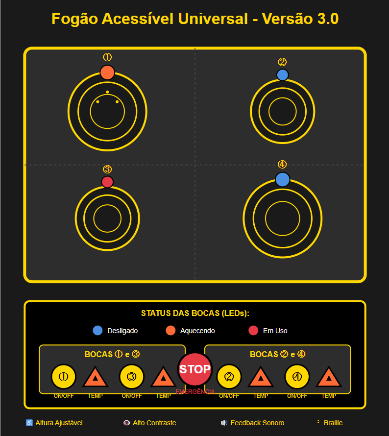

# 📘 Fogão Acessível Universal – Projeto de Interface Inclusiva
**Disciplina:** Desenvolvimento para Internet 1  
**Tema:** UX/UI – Usabilidade e Acessibilidade na Interface de um Fogão  
**Autor:** *Marcone Silva de Brito*  

---

## 🖼️ Imagem do Projeto
> Insira aqui a imagem criada manualmente da interface acessível do fogão.  
> **Caminho sugerido dentro do repositório:**

```
img/fogao-acessivel.png
```

**Exemplo de inclusão no README.md:**

```markdown

```


---

## 📖 Sobre o Projeto
Este projeto consiste na criação de um site estático em HTML com CSS inline, cujo objetivo é apresentar o redesign de uma interface de fogão considerando princípios de usabilidade, acessibilidade, empatia e design centrado no ser humano.

---

## 🧭 Contextualização
Durante a vídeo-aula sobre UX aplicada à interface de fogões convencionais, foi analisado como a experiência do usuário pode ser profundamente melhorada quando o design considera acessibilidade, autonomia e segurança.

---

## 🎯 Objetivo do Projeto
Criar um site que:
- Apresente o(a) projetista;
- Mostre a nova interface acessível do fogão;
- Explique o conceito e as estratégias de design;
- Inclua um manual acessível de utilização;
- Use exclusivamente HTML + CSS inline.

---

## 🧩 Estrutura do Projeto
```
/projeto-fogao-acessivel
│
├── index.html
├── img/
│   └── fogao-acessivel.png
└── README.md
```

---

## 👤 1. Apresentação do Projetista
Reflexões sobre o papel do designer, empatia, inclusão e importância de tornar objetos cotidianos universalmente acessíveis.

---

## 🔥 2. Nova Interface do Fogão Acessível

### Principais Elementos Inclusivos
- Botões com texturas distintas e Braille  
- LEDs de status  
- Formas diferenciadas  
- Alto contraste  
- Altura ajustável  

### Conceito
Baseado no Design Universal, garantindo percepção multisensorial, tolerância a erros, operação intuitiva e robustez.

---

## 📖 3. Manual de Utilização do Fogão

### Tabela de Controles
| Controle | Formato | Função |
|---------|---------|--------|
| Botão Principal | Circular | Liga/Desliga |
| Controle de Chama | Triangular | Intensidade |
| Timer | Quadrado | Tempo |
| Emergência | Redondo vermelho | Desligamento total |

### Passo a Passo
1. Selecione a boca  
2. Pressione por 2s  
3. Ajuste a chama  
4. Utilize com segurança  
5. Desligue com novo toque  

---

## 🔧 Requisitos Técnicos
- HTML puro  
- CSS inline  
- Sem JavaScript  
- Imagem criada manualmente  

---

## 📁 Entrega
Enviar o link do repositório GitHub no Moodle com o arquivo contendo o caminho da entrega.

---

## 🧮 Critérios de Avaliação
- Estrutura HTML e CSS inline — 1,0  
- Imagem original — 1,0  
- Usabilidade — 0,5  
- Manual de uso — 0,5  

---

## © Créditos
Marcone Silva de Brito – 2025
